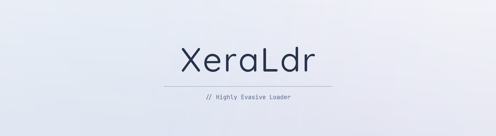
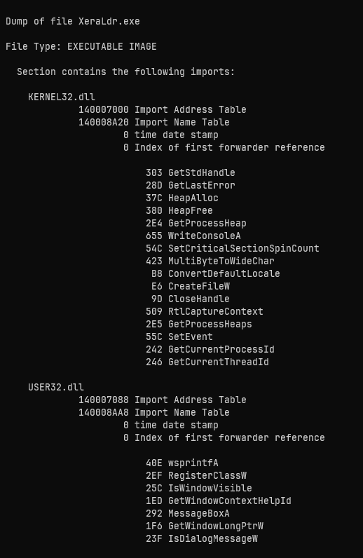
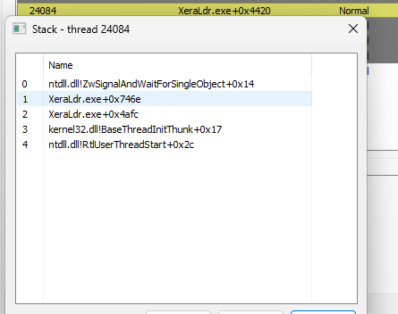
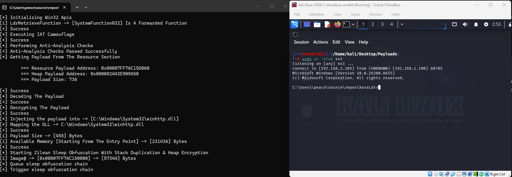

# XeraLdr

A stealthy and modular Windows loader developed by **xec412**.

<p align="center">
  
</p>

<a href="https://trendshift.io/repositories/74899?utm_source=trendshift-badge&amp;utm_medium=badge&amp;utm_campaign=badge-trendshift-74899" target="_blank" rel="noopener noreferrer"></a>

## ⚠️ Disclaimer

This project is for **educational and research purposes only**.  
Unauthorized use against systems you do not own is illegal.

---

## Overview

XeraLdr is a custom loader designed to execute payloads with high stealth against modern EDR solutions.

**Tested Against:** Microsoft Defender for Endpoint (MDE)  
**Result:** No alerts appeared after several hours of activity.

**Video Demonstration:** [Bypassing MDE - XeraLdr Showcase](https://www.youtube.com/watch?v=Y_QTzyn_hFA)

**Payload Used:** Custom written reverse TCP shellcode

---

## Core Techniques & Why They Were Chosen

### 1. Module Stomping (Sacrificial DLL Technique)
- **Why?** Most memory scanners focus on newly allocated private memory regions. By stomping a legitimate system DLL, we operate inside an image-backed trusted memory space.
- **Strength:** Very strong against memory scanners and heuristic detection.

### 2. IAT Camouflage + Library Proxy Loading
- **Why?** Many EDRs monitor suspicious Import Address Tables and API resolutions.
- **Strength:** Provides excellent protection against static and behavioral analysis.

### 3. Proxy Execute API
- **Why?** Direct API calls are heavily monitored. Using proxy functions helps evade behavioral detection.
- **Strength:** Reduces suspicious API call patterns.

### 4. Advanced Anti-Analysis
- **Why?** Prevents execution in virtual machines, debuggers, and sandboxes.
- **Strength:** Protects the loader during initial execution phase.
- **Reference:** [Sandbox-Detection-Techniques](https://github.com/arxhr007/Sandbox-Detection-Techniques)

### 5. ChaCha20 Encryption + BaseN Encoding
- **Why?** Strong encryption makes static signature detection significantly harder.
- **Strength:** Payload remains encrypted until runtime.
- **Reference:** [LibTomCrypt](https://github.com/libtom/libtomcrypt)

### 6. CRT-Free Binary
- **Why?** Removes dependency on the Visual C++ Runtime, resulting in a smaller binary with a minimal Import Address Table (IAT). This reduces static signatures commonly flagged by EDRs and AVs.

### 7. Zilean Sleep Obfuscation (with Stack Duplication & Heap Encryption)
- **Why?** Classic `Sleep()` is easily detected. Using `SystemFunction040/041` (RtlEncryptMemory / RtlDecryptMemory) for heap encryption + stack duplication makes sleep periods much stealthier.
- ** - **Warning:** If you are using a transient payload like `calc.exe`, the process will execute the payload and immediately invoke `ExitThread`. As a result, the sleep obfuscation mechanism will not trigger. For this technique to work as intended, ensure you are using a persistent payload (e.g., a reverse shell) that keeps the thread execution flow alive.
- **Reference:** [C5pider's Tweet](https://x.com/C5pider/status/1743209459533435308)

---

## Screenshots

### 1. IAT Camouflage


### 2. Call Stack Analysis


### 3. Successful Reverse Shell


---

## Build Instructions

1. Clone the repository:
   ```bash
   git clone https://github.com/xec412/XeraLdr.git
   ```

2. Open the solution file `XeraLdr.slnx` with Visual Studio.

3. Select **Release | x64** configuration.

4. Go to **Build -> Rebuild Solution**.

All necessary build settings are already configured in the project. No additional changes are required.

---

If you find the engineering choices or the implementation useful, dropping a star on the repository would be highly appreciated! ⭐

---

## Learning Resources

- [Maldev Academy](https://maldevacademy.com)

---

## References

- [Sandbox-Detection-Techniques](https://github.com/arxhr007/Sandbox-Detection-Techniques)
- [LibTomCrypt](https://github.com/libtom/libtomcrypt)
- [C5pider's Tweet on Sleep Obfuscation](https://x.com/C5pider/status/1743209459533435308)

---

## Legal

This project is licensed under the **GPL-3.0 License**.  
See the [LICENSE](LICENSE) file for details.
